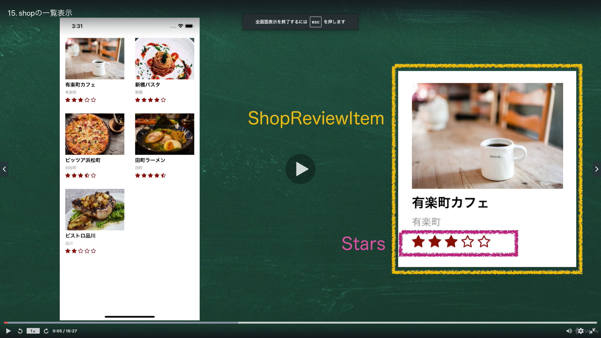

# Section03:Firebaseで検索やソートを実装してみよう

<a id = "contents">

# Contents
* [Flow](#flow)
* [prepare](#prepare)
* [view](#view)
* [sort](#sort)

### Pickup
* 

<a id = "flow">

## Flow
* 

### [Return to Contents](#contents)

<a id = "prepare">

## prepare
* 
* 
* 
* 

## use this
* [Sample Data](https://github.com/takahi5/shop-review)

### [Return to Contents](#contents)

<a id = "view">

## view
* 

## use this
* [Sample Code](https://github.com/takahi5/shop-review/tree/sec3/shop-review-item/shop-review-app)
* [FlatList](https://reactnative.dev/docs/flatlist)
* [Search Icons](https://icons.expo.fyi/)
* [Icons](https://docs.expo.io/guides/icons/)

### [Return to Contents](#contents)

<a id = "sort">

## sort
* 
* 
* 
* 

### [Return to Contents](#contents)

