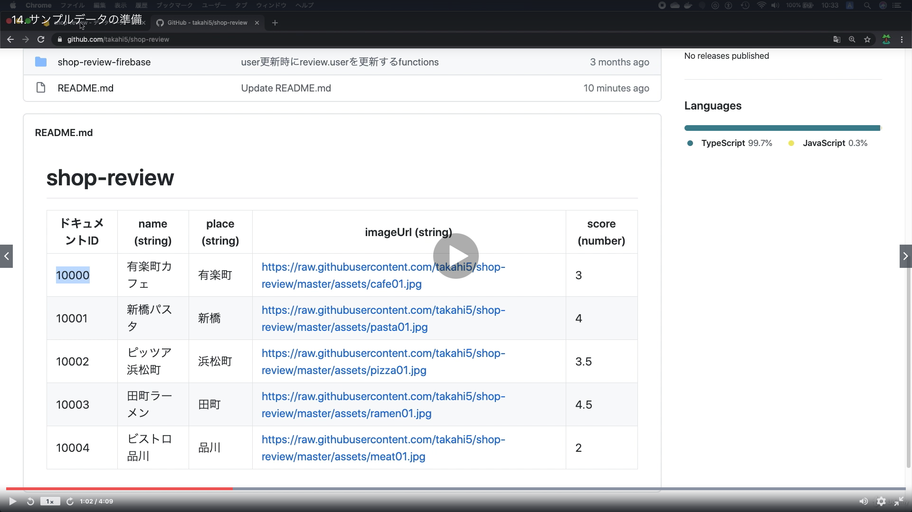

# Section03:Firebaseで検索やソートを実装してみよう

<a id = "contents">

# Contents
* [Flow](#flow)
* [prepare](#prepare)

### Pickup
* 

<a id = "flow">

## Flow
* 

### [Return to Contents](#contents)

<a id = "prepare">

## prepare
* 
* 
* 
* 

## use this
* [Sample Data](https://github.com/takahi5/shop-review)

### [Return to Contents](#contents)

