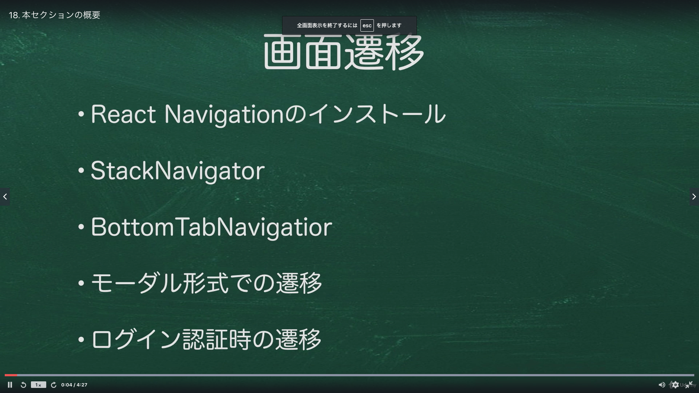
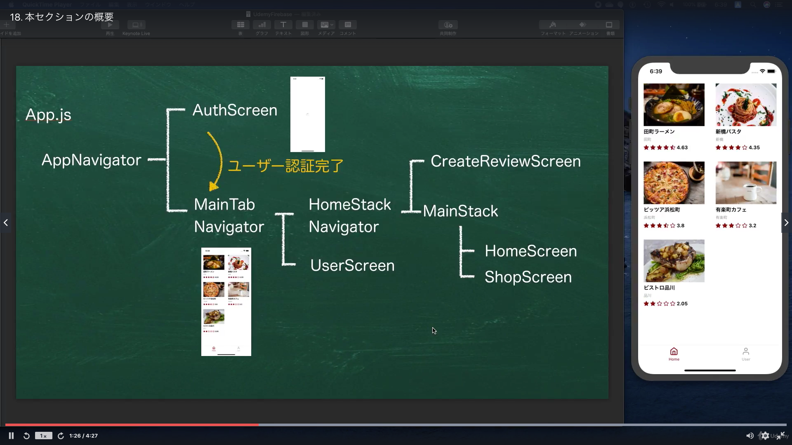
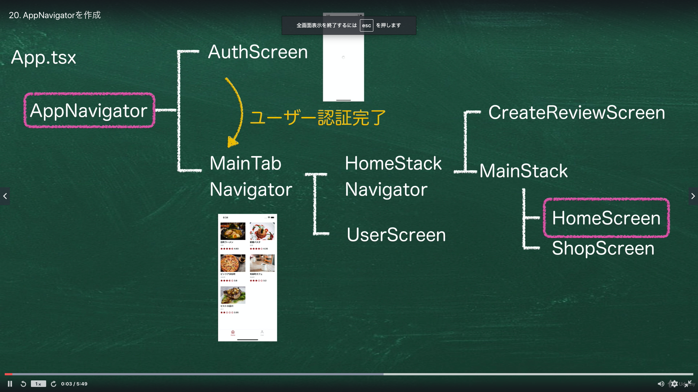
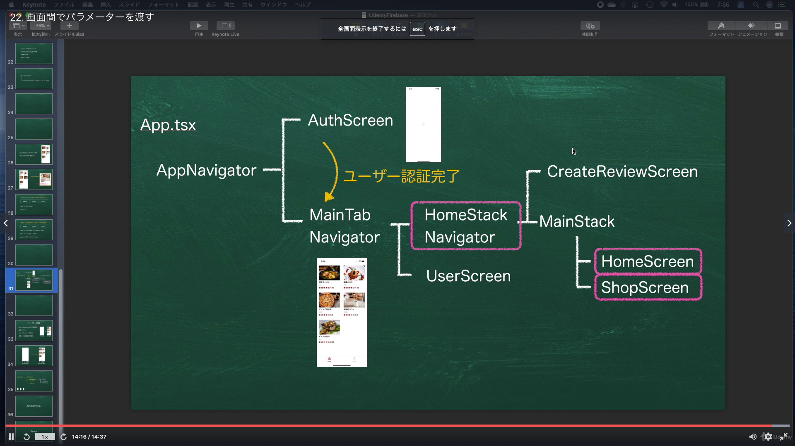
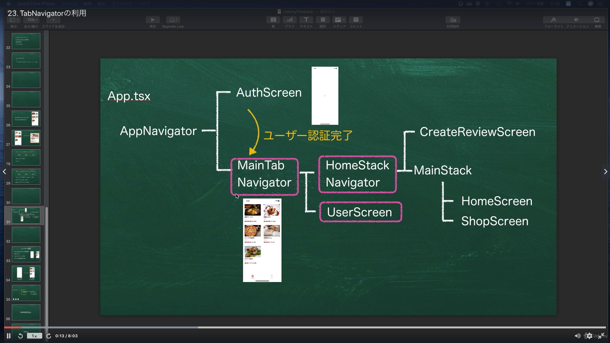
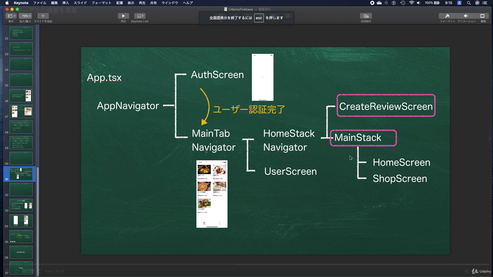

# Section04:React Nativeの遷移画面を実装しよう

<a id = "contents">

# Contents
* [Flow](#flow)
* [AppNavigation](#AppNavigation)
* [SlackNavigator](#SlackNavigator)
* [Parameter](#Parameter)
* [TabNavigator](#TabNavigator)
* [Modal](#modal)

### Pickup
* 


<a id = "flow">

## Flow
* 
* 

### [Return to Contents](#contents)


<a id = "ReactNavigation">

## ReactNavigation
* 

* commands
  ```
  npm install @react-navigation/native
  npm install react-native-gesture-handler react-native-reanimated react-native-screens react-native-safe-area-context @react-native-community/masked-view
  npm install @react-navigation/stack
  npm install @react-navigation/bottom-tabs
  ```

## Pickup
* [Routing & Navigation](https://docs.expo.io/guides/routing-and-navigation/)
* [Getting started](https://reactnavigation.org/docs/getting-started/)
* [createStackNavigator](https://reactnavigation.org/docs/stack-navigator/)
* [createBottomTabNavigator](https://reactnavigation.org/docs/bottom-tab-navigator/)

### [Return to Contents](#contents)


<a id = "AppNavigation">

## AppNavigation
* 

## Pickup
* [Source Code](https://github.com/takahi5/shop-review/tree/sec4/app-navigator/shop-review-app)

### [Return to Contents](#contents)


<a id = "SlackNavigator">

## SlackNavigator
* 

## Pickup
* [createStackNavigator](https://reactnavigation.org/docs/stack-navigator/)

### [Return to Contents](#contents)


<a id = "Parameter">

## Parameter
* 

## Pickup
* [Type checking with TypeScript](https://reactnavigation.org/docs/typescript/)

### [Return to Contents](#contents)


<a id = "TabNavigator">

## TabNavigator
* 

* commands
  ```
  yarn add react-native-screens
  ```

## Pickup
* [createBottomTabNavigator](https://reactnavigation.org/docs/bottom-tab-navigator/)
* [React Native で画面遷移やタブメニュー【react-navigation 5.x】](https://qiita.com/dhythm/items/125ab18844fe86ec4041)

### [Return to Contents](#contents)


<a id = "modal">

## Modal
* 

## Pickup
* [https://reactnavigation.org/docs/modal/#creating-a-modal-stack](Creating a modal stack)

### [Return to Contents](#contents)
