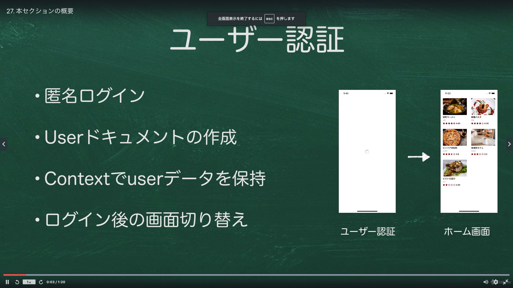
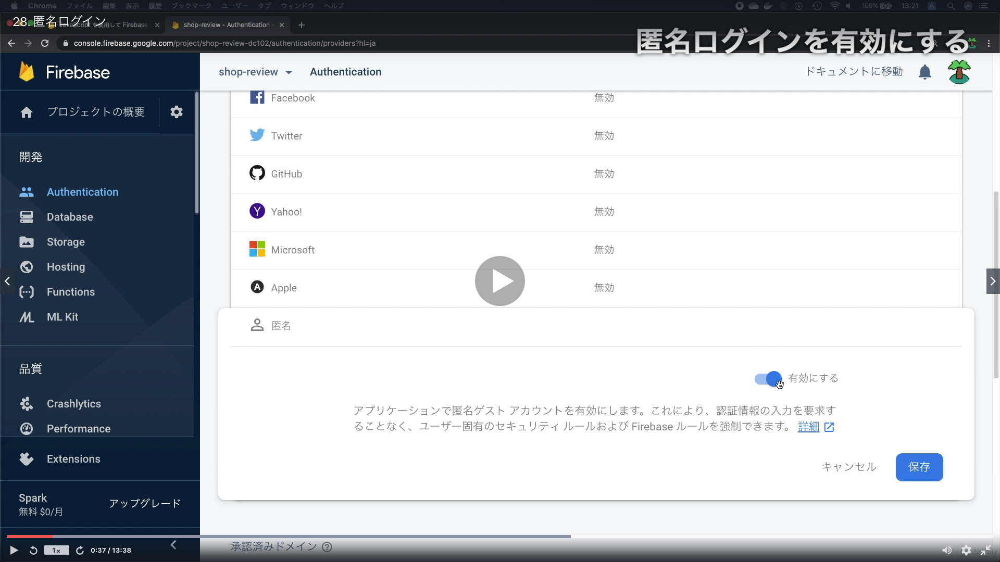
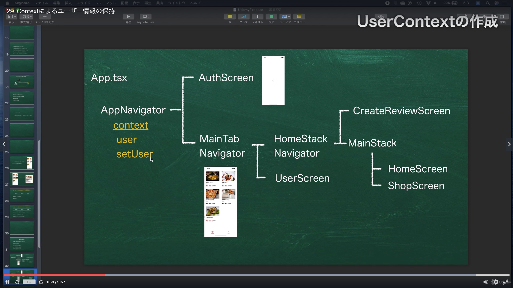
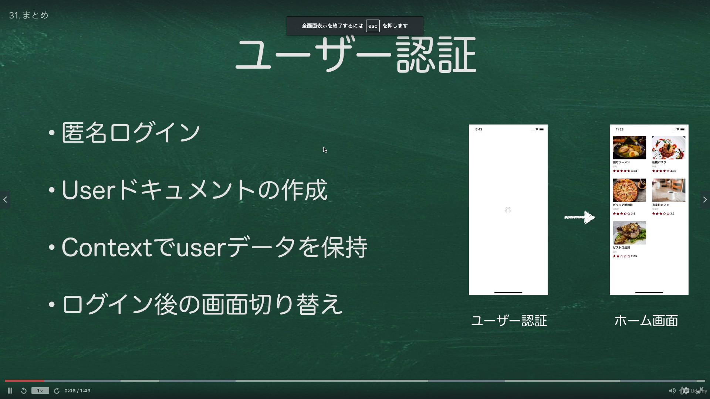

# Section05:Firebase auth でユーザー認証を実装しよう

<a id = "contents">

# Contents
* [Flow](#flow)
* [Login](#Login)
* [Context](#Context)
* [Login2](#Login2)

### Pickup
* 

<a id = "flow">

## Flow
* 

### [Return to Contents](#contents)

<a id = "Login">

## Login
* 

## Pickup
* [JavaScript を使用して Firebase 匿名認証を行う](https://firebase.google.com/docs/auth/web/anonymous-auth?hl=ja)

### [Return to Contents](#contents)

<a id = "Context">

## Context
* 

## Pickup
* [コンテクスト](https://ja.reactjs.org/docs/context.html)

### [Return to Contents](#contents)

<a id = "Login2">

## Login2
* 

### [Return to Contents](#contents)