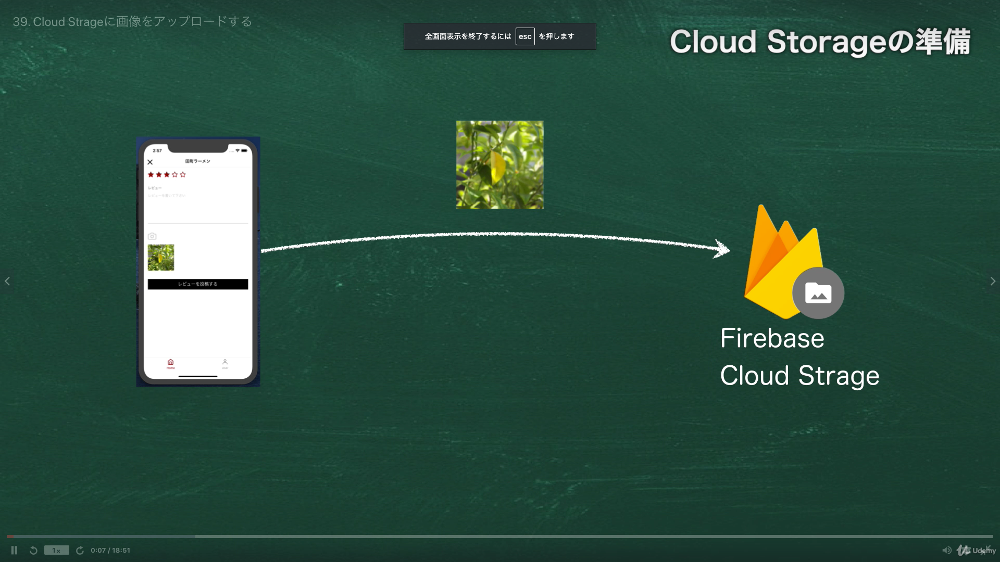
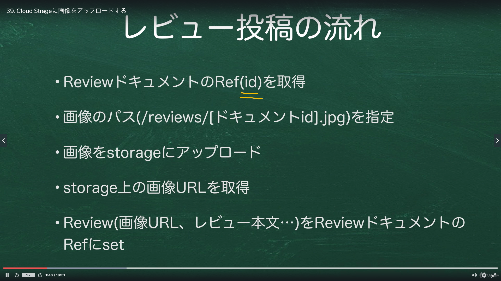
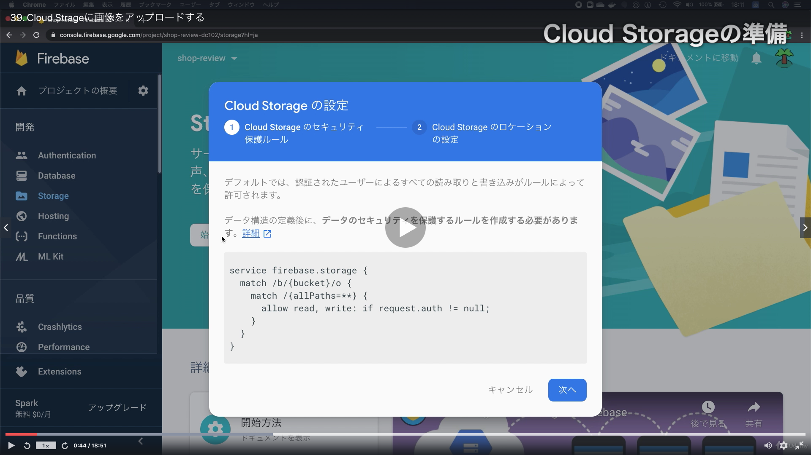
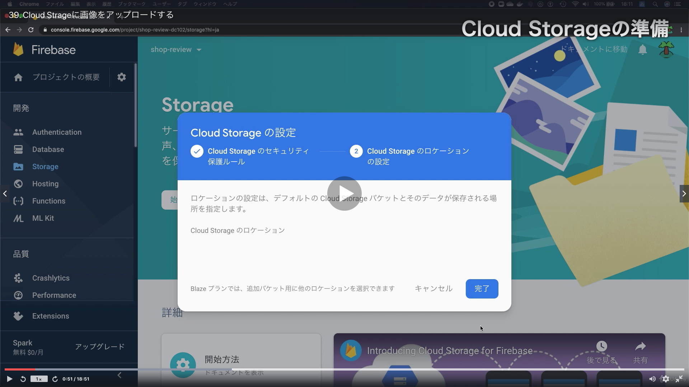
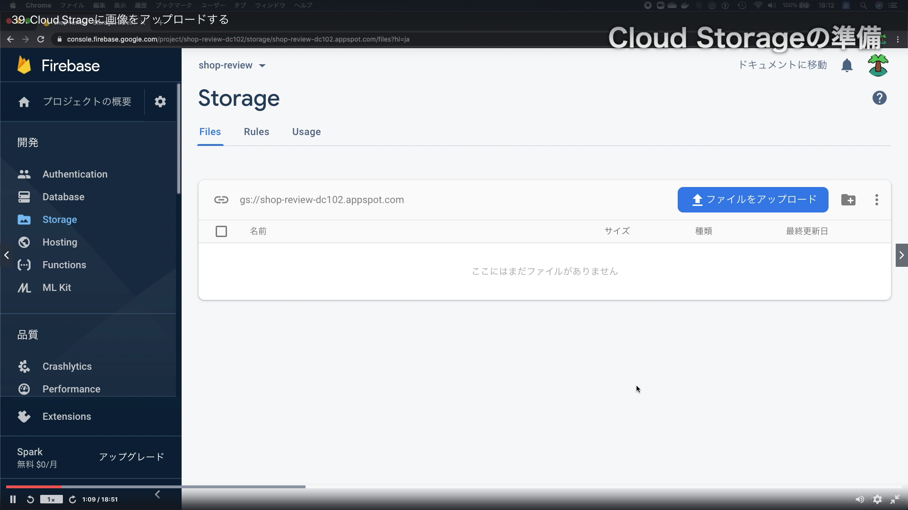

# Section06:Firestoreのデータを更新する

<a id = "contents">

# Contents
* [Flow](#flow)
* [User Infomation](#UserInfomation)
* [Denormalized](#Denormalized)
* [Review](#Review)
* [ImagePicker](#ImagePicker)
* [CloudStrage](#CloudStrage)

### Pickup
* 


<a id = "flow">

## Flow
* 

### [Return to Contents](#contents)


<a id = "UserInfomation">

## User Infomation
* 

### [Return to Contents](#contents)


<a id = "Denormalized">

## Denormalized
* 

### [Return to Contents](#contents)


<a id = "Review">

## Review
* 

### [Return to Contents](#contents)


<a id = "ImagePicker">

## ImagePicker
* 

* commands
  ```
  expo install expo-image-picker
  ```

## Pickup
* [ImagePicker](https://docs.expo.io/versions/latest/sdk/imagepicker/)
* [expoプロジェクトでiOSで送信されない許可リクエストを修正する方法](https://www.366service.com/jp/qa/be485617724e18e296a751588df7b3fb)
* [iOSの実機での確認](https://qiita.com/yacchi1123/items/5a3d16f0d92d3912e5c4#6-ios%E3%81%AE%E5%AE%9F%E6%A9%9F%E3%81%A7%E3%81%AE%E7%A2%BA%E8%AA%8D)

### [Return to Contents](#contents)


<a id = "CloudStrage">

## CloudStrage
* 
* 
* 
* 
* 

## Pickup
* [テンプレートリテラル (テンプレート文字列)](https://developer.mozilla.org/ja/docs/Web/JavaScript/Reference/Template_literals)

### [Return to Contents](#contents)