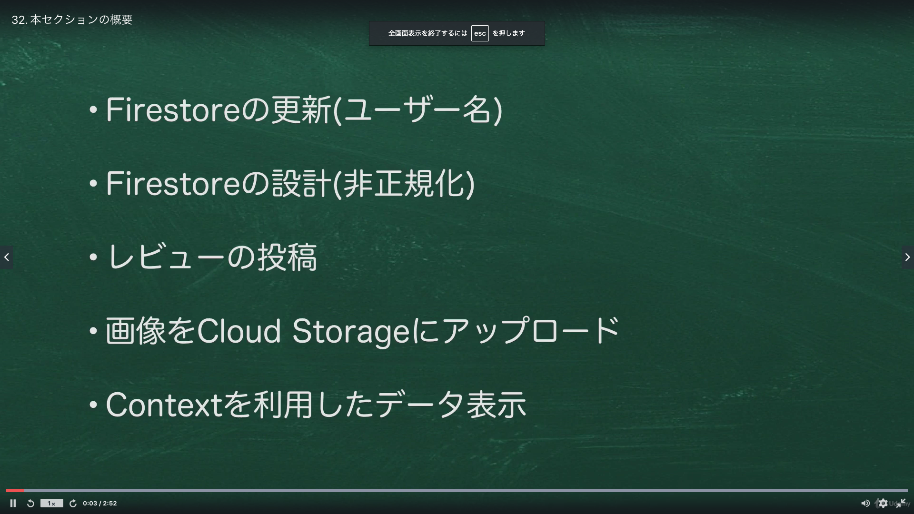
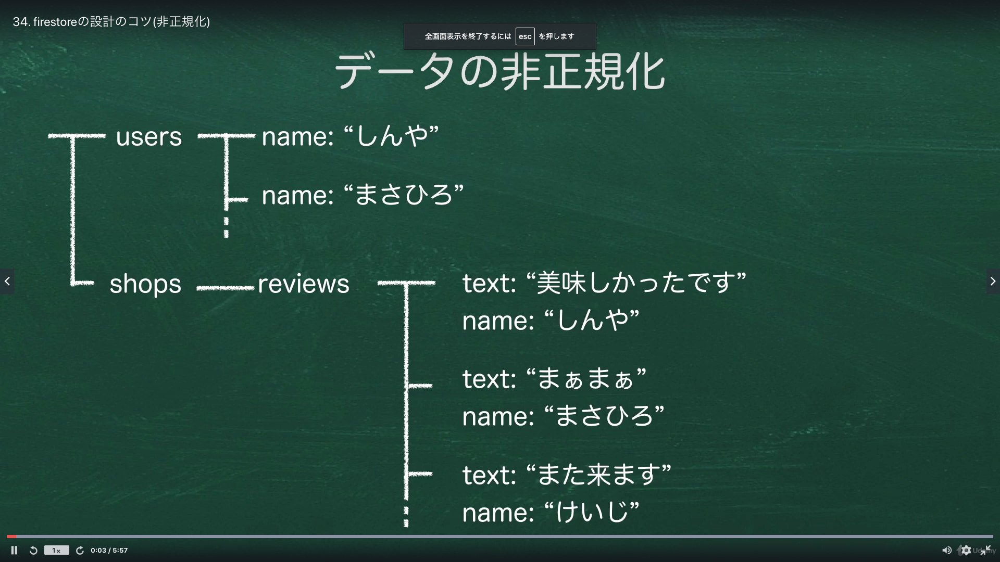

# Section06:Firestoreのデータを更新する

<a id = "contents">

# Contents
* [Flow](#flow)
* [User Infomation](#UserInfomation)
* [Denormalized](#Denormalized)

### Pickup
* 

<a id = "flow">

## Flow
* 

### [Return to Contents](#contents)

<a id = "UserInfomation">

## User Infomation
* 

### [Return to Contents](#contents)

<a id = "Denormalized">

## Denormalized
* 

### [Return to Contents](#contents)