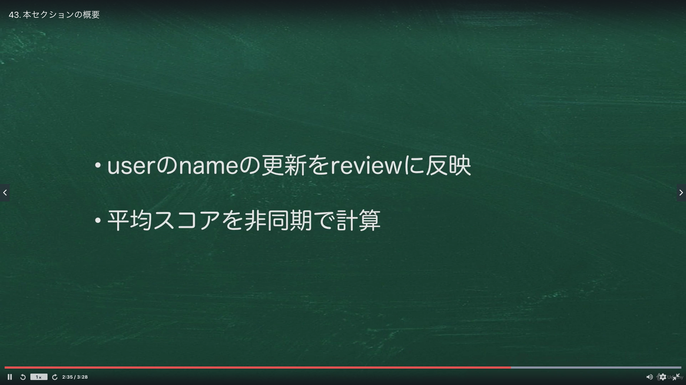
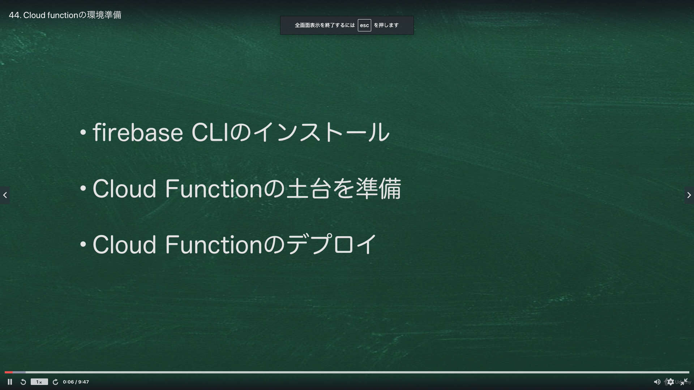

# Section07:Cloud function でバックエンド処理を実装しよう

<a id = "contents">

# Contents
* [Flow](#flow)
* [CloudFunction](#CloudFunction)

### Pickup
* 


<a id = "flow">

## Flow
* 
* 

### [Return to Contents](#contents)


<a id = "CloudFunction">

## FlCloudFunctionow
* 

* commands
   ```
   npm install firebase-tools
   mkdir shop-review-firebase
   cd shop-review-firebase
   firebase login
   ```
   ```
   firebase init
   ```
   * you need to change node version 10 and move @functions folder
   * change index.ts before building 
     * before: v12.18.3 (npm  uninstall --force node)
     * after : v10.19.0
     * [MacにNode.jsをnodebrewでインストールして環境構築【決定版】](https://qiita.com/7110/items/efe0be1be11bed1db143)
     * [インストールしている Node.js のバージョンをダウングレードさせるために n を使ってみる](https://zenn.dev/ymasaoka/articles/using-n-for-downgrade-nodejs)
  * if you select tsc, run these commands
   ```
   yarn install
   ```
   ```
   yarn build
   ```
  
  * deploy
    ```
    firebase deploy --only functions 
    ```

## Pickup
* [Firebase CLI リファレンス](https://firebase.google.com/docs/cli)
* [はじめに: 最初の関数の記述、テスト、デプロイ](https://firebase.google.com/docs/functions/get-started)

### [Return to Contents](#contents)
