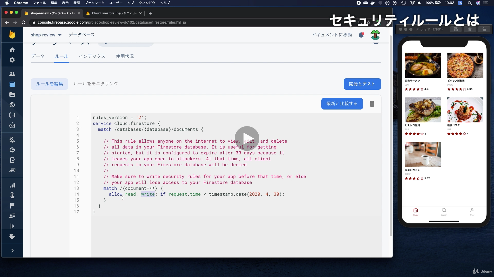
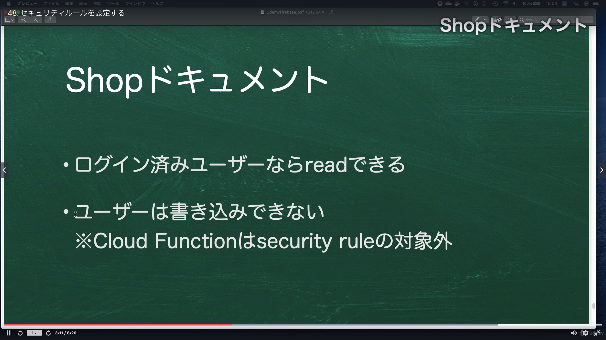
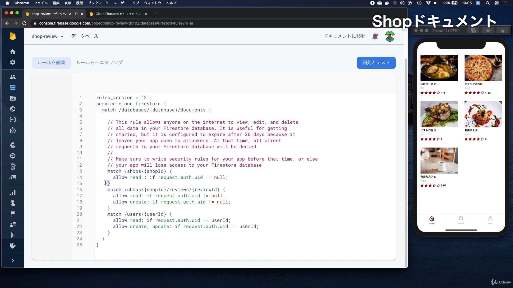
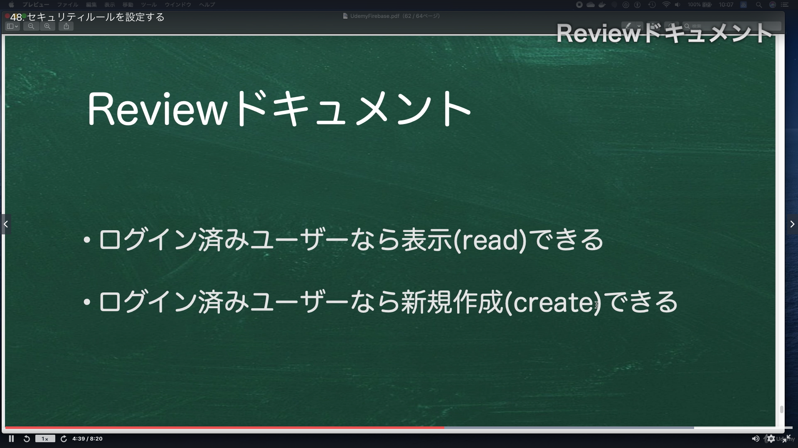
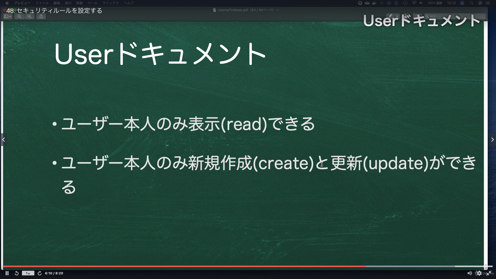
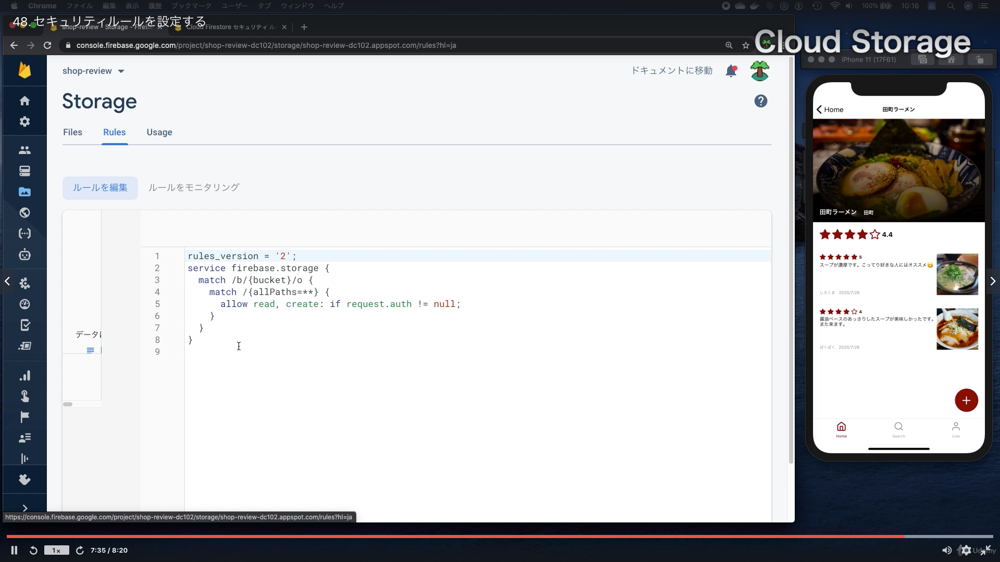

# Section08:セキュリティルールについて

<a id = "contents">

# Contents
* [Flow](#flow)

### Pickup
* [Cloud Firestore セキュリティ ルールを使ってみる](https://firebase.google.com/docs/firestore/security/get-started?hl=ja)

<a id = "flow">

## Flow
* 
* 
* 
* 
* 
* 

### [Return to Contents](#contents)