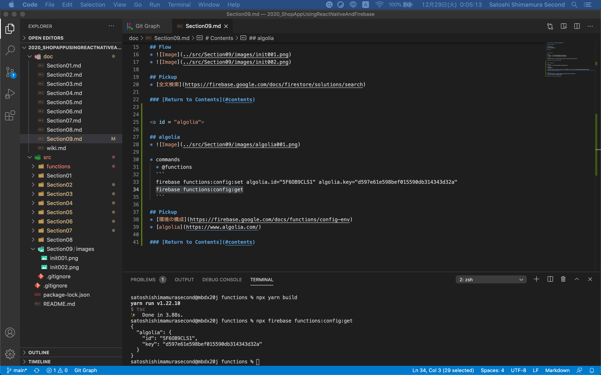

# Section09:algoliaで全文検索を実装しよう

<a id = "contents">

# Contents
* [Flow](#flow)
* [algolia](#algolia)

### Pickup
* 


<a id = "flow">

## Flow
* 
* 

## Pickup
* [全文検索](https://firebase.google.com/docs/firestore/solutions/search)

### [Return to Contents](#contents)


<a id = "algolia">

## algolia
* 
* 
* 
* 
* 
* 
* 
* 
* 
* 

* commands
  * @functions
  ```
  firebase functions:config:set algolia.id="5F6OB9CLS1" algolia.key="d597e61e598bef015590db314343d32a"
  firebase functions:config:get
  ```

## Pickup
* [環境の構成](https://firebase.google.com/docs/functions/config-env)
* [algolia](https://www.algolia.com/)

### [Return to Contents](#contents)