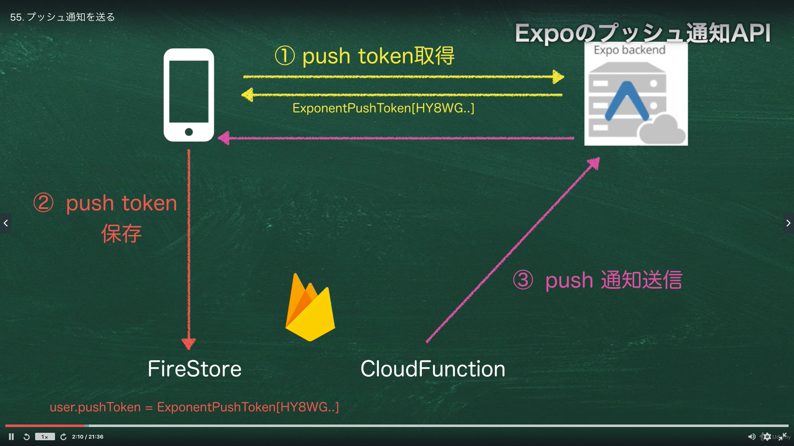
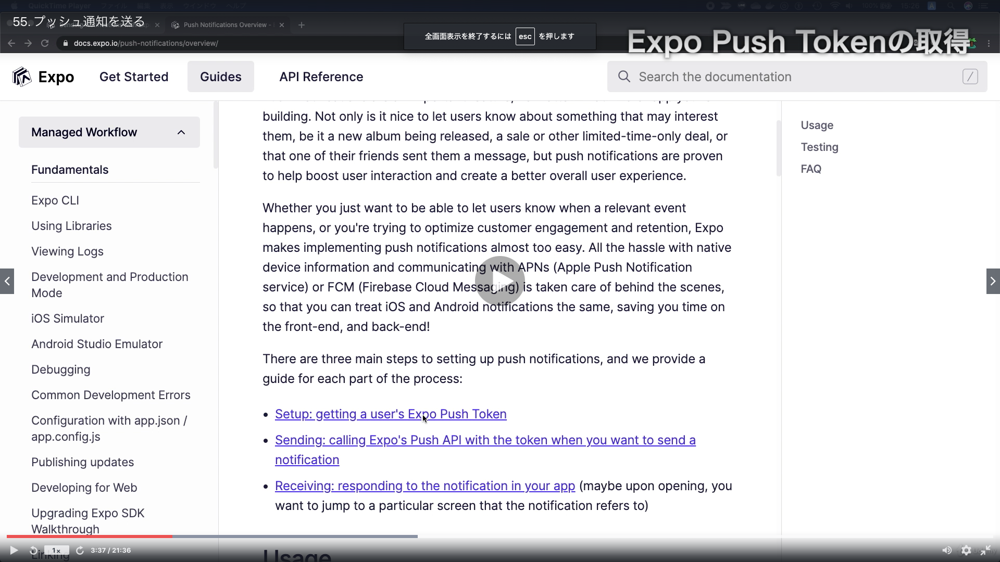
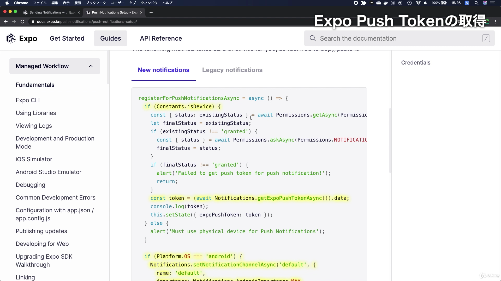
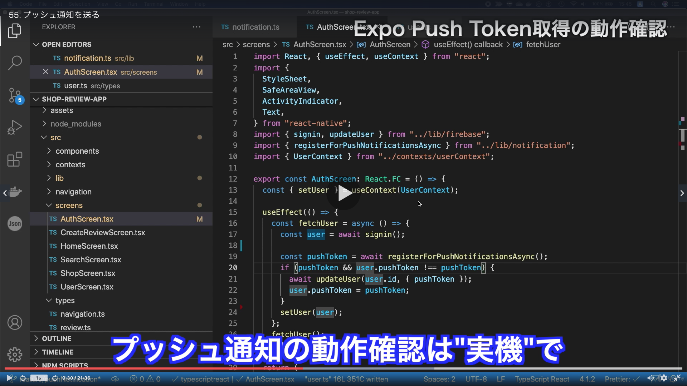
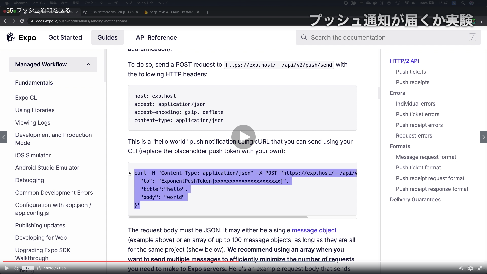
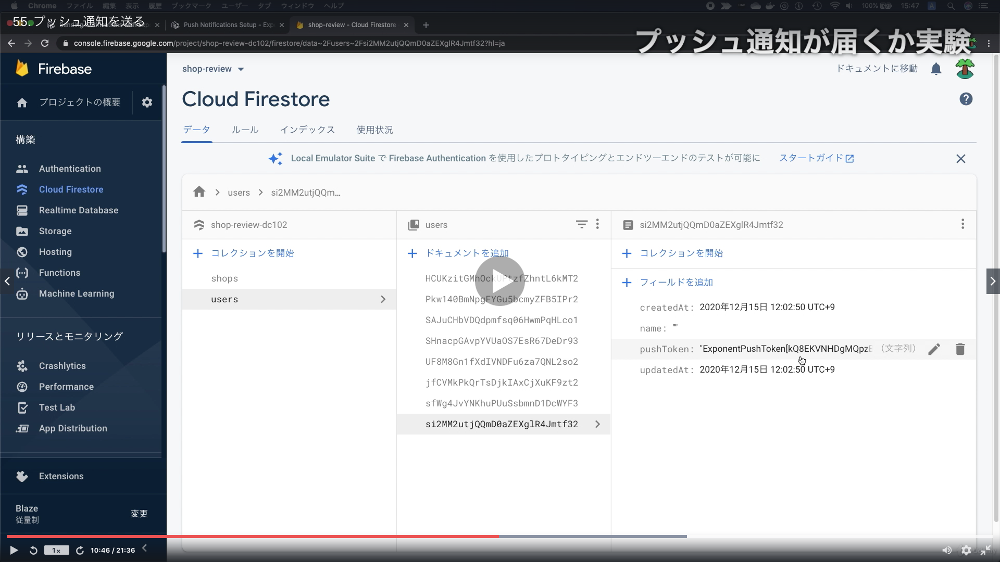
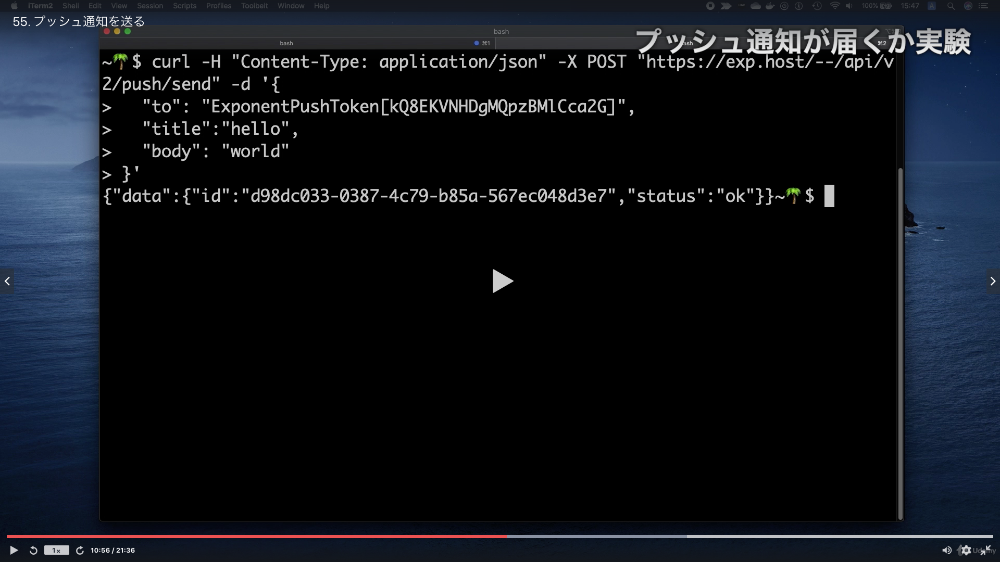
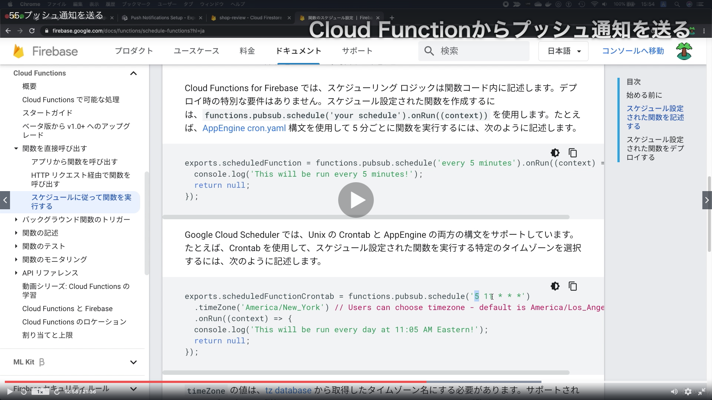
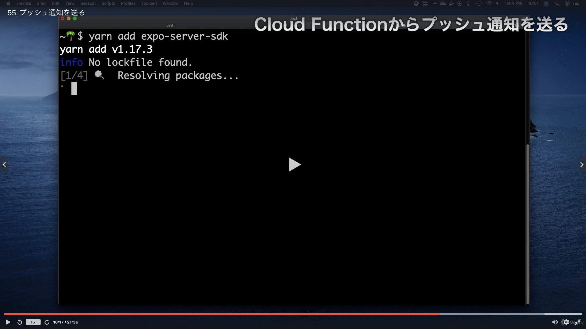
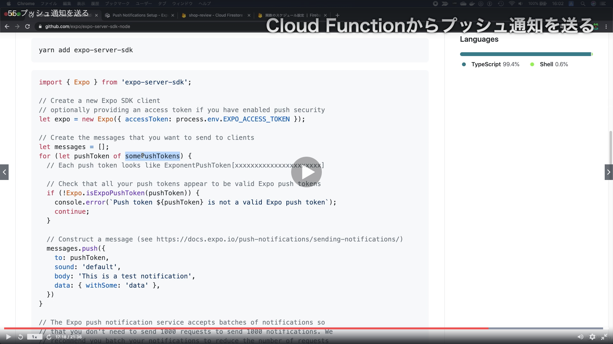

# Section11:Push通知を送る

<a id = "contents">

# Contents
* [Flow](#flow)

### Pickup
* 


<a id = "flow">

## Flow
* 
* 
* 
* 
* 
* 
* 
* 
* 
* 

* commands
  * try push
    ```
    curl -H "Content-Type: application/json" -X POST "https://exp.host/--/api/v2/push/send" -d '{
    "to": "ExponentPushToken[2ciKg3CUo0siHOisqu9SUK]",
    "title":"hello",
    "body": "world"
    }'
    ```
* install @functions
  ```
  yarn add expo-server-sdk
  ```

## Pickup
* [Push Notifications Overview](https://docs.expo.io/push-notifications/overview/)
* [expo-server-sdk-node](https://www.npmjs.com/package/expo-server-sdk)

### [Return to Contents](#contents)